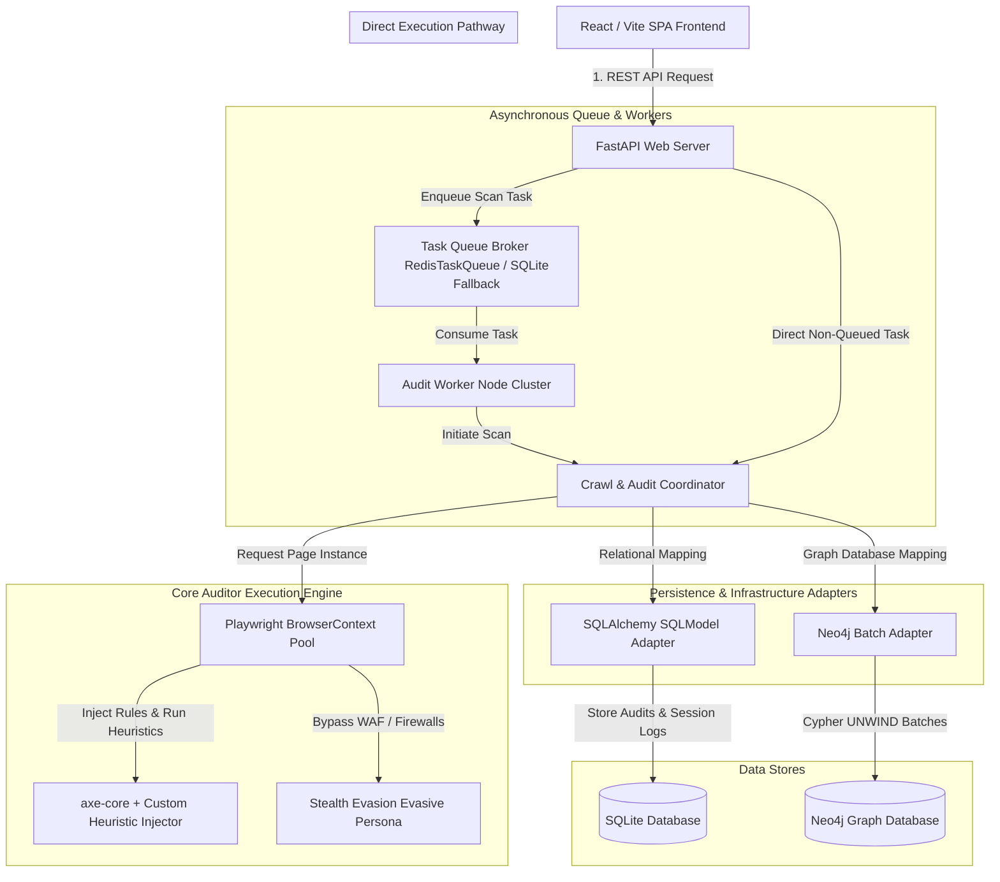
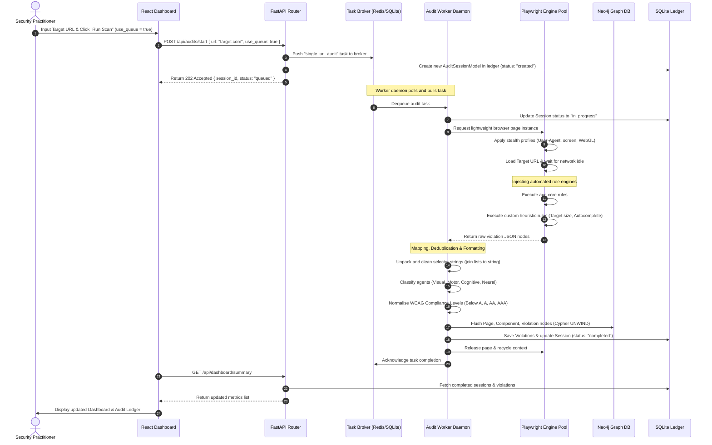
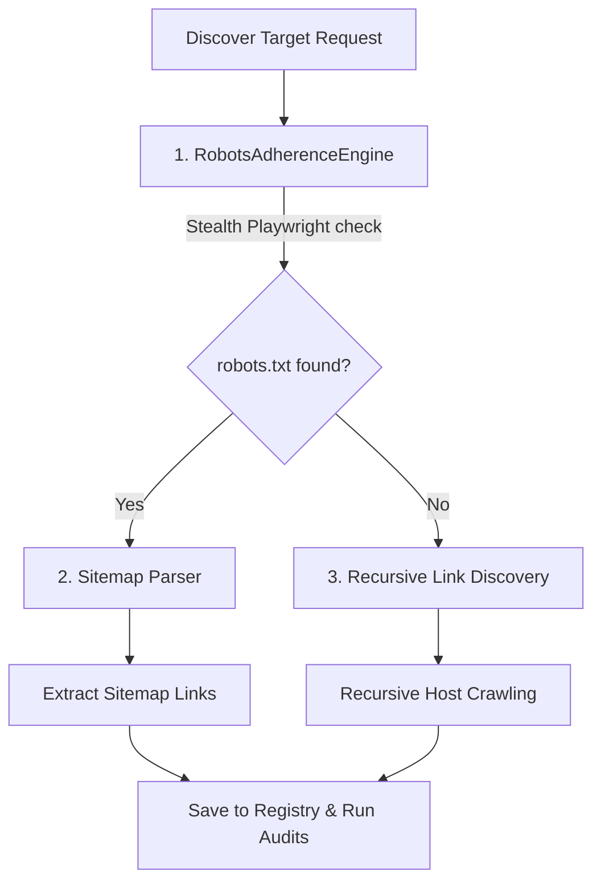
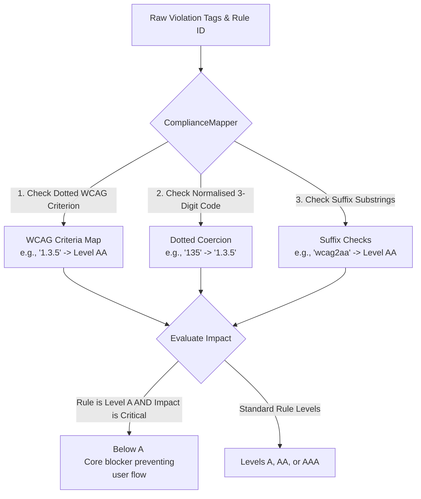
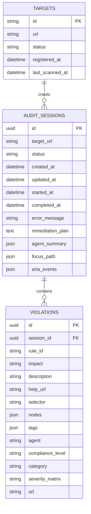
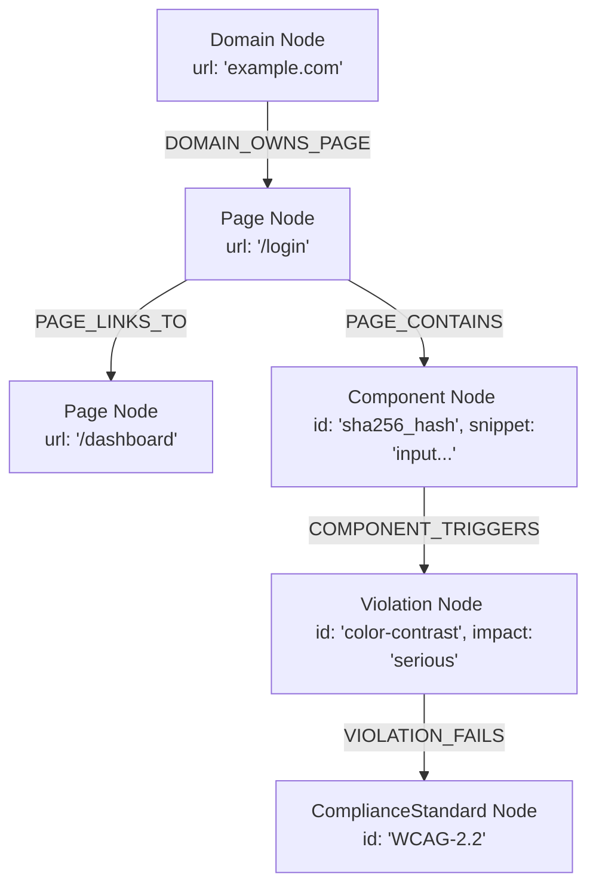

# A11yAudit: Enterprise Web Accessibility Forensics and Audit Engine

An enterprise-grade, high-performance automated accessibility forensics engine engineered to crawl, diagnose, record, and remediate compliance violations at scale. The system evaluates web targets against the Web Content Accessibility Guidelines (WCAG 2.2 A/AA/AAA), the Indian Guidelines for Government Websites (GIGW 3.0), and the Reserve Bank of India (RBI) accessibility master circulars.

The core engine utilizes recycled stealth-configured headless browser instances, autonomous multi-agent rule injection, in-memory transaction batching, and dual-persistence graph/relational databases to execute full-scale, non-destructive compliance audits on public or private domains.

---

## Table of Contents
1. [Key Systems and Performance Optimizations](#key-systems-and-performance-optimizations)
2. [Architectural Topology](#architectural-topology)
3. [System Flow and Interaction Lifecycles](#system-flow-and-interaction-lifecycles)
4. [Heuristic Diagnostics and Multi-Agent Architecture](#heuristic-diagnostics-and-multi-agent-architecture)
5. [Autonomous Discovery and Bulk Import Pipeline](#autonomous-discovery-and-bulk-import-pipeline)
6. [Compliance Mapping and Level Normalization](#compliance-mapping-and-level-normalization)
7. [Database Schema and Persistence Models](#database-schema-and-persistence-models)
8. [REST API Routing Specification](#rest-api-routing-specification)
9. [Frontend Interface and Dashboard Layout](#frontend-interface-and-dashboard-layout)
10. [CLI Orchestration and Daemon Services](#cli-orchestration-and-daemon-services)
11. [Verification and Testing Suite](#verification-and-testing-suite)
12. [Deployment and Environment Setup](#deployment-and-environment-setup)
13. [Hugging Face Spaces Deployment](#hugging-face-spaces-deployment)

---

## Key Systems and Performance Optimizations

To execute continuous, high-throughput crawls and accessibility diagnostics without incurring memory leaks or CPU throttling, A11yAudit implements three core systems-level patterns:

### 1. Playwright BrowserContext Recycling and Evasion
Launching a separate browser process or distinct context for every page in a crawl tree generates severe overhead. To bypass this limitation:
* **Stealth Context Pooling**: The system initializes a single, highly-optimized BrowserContext pre-configured with evasive user-agent strings, canvas/webgl noise, and touch-screen emulation.
* **Lightweight Page Recycling**: Pages are spawned dynamically within this context, reusing TCP connections and cache structures.
* **Crash and Evasion Recovery**: If a page triggers a Web Application Firewall (WAF) challenge, timeouts, or rendering exceptions, the orchestrator discards the context, rotates user personas, and recycles a fresh context seamlessly.

### 2. Cypher UNWIND Database Write Batching (Neo4j)
Writing nodes (pages, components, violations) and their respective links individually to a Neo4j database introduces severe round-trip time (RTT) overhead and connection saturation.
* **In-Memory Buffering**: The engine queues structural links and violation mappings in-memory.
* **UNWIND Array Commits**: Transactions are flushed in batches using Cypher's UNWIND clause, which processes list parameters in a single transaction block. This reduces database transaction cycles by up to 90%.

### 3. Asynchronous Dual-Persistence Task Broker
The audit processing pipeline utilizes a flexible, decoupled task architecture:
* **Broker Abstraction**: Implements a RedisTaskQueue broker. If Redis is offline, it transparently falls back to a thread-safe SQLite-backed database queue.
* **Concurrency Gates**: High-throughput scans are run in the background via independent consumer processes (AuditWorker). Web clients receive immediate receipts (202 Accepted), and workers consume queued tasks sequentially, protecting the web server from memory overload.

---

## Architectural Topology

The following diagram illustrates the relationship between the client presentation layer, FastAPI routers, the dual-persistence task queue, Playwright worker runtimes, and the storage layers:



---

## System Flow and Interaction Lifecycles

This sequence diagram details the operational lifecycle of a queued URL scan, demonstrating the browser context execution, audit injection, mapping, and database flushing:



---

## Heuristic Diagnostics and Multi-Agent Architecture

Violations are analyzed by four specialized automated agents, each targeting a specific class of accessibility barriers. This guarantees that issues are mapped to functional user impacts rather than raw technical rules.

| Accessibility Agent | Focus Area | Example Rules / Detections |
| :--- | :--- | :--- |
| **Visual Agent** | Screen reader accessibility, color contrast, media alternatives. | Color contrast ratios, image alt attributes, zoom settings. |
| **Motor Agent** | Keyboard navigation, interactive target sizes, focus management. | Interactive targets under 44x44px, missing focus rings. |
| **Cognitive Agent** | Form constraints, page readability, input autocomplete helper. | Autocomplete attributes on credentials/personal inputs. |
| **Neural Agent** | Animation constraints, dynamic layout stability, media playback. | Autoplay controls, flashing media, content shifts. |

### Custom Heuristic Violations

In addition to standard axe-core violations, the engine executes customized scripts to detect issues that static engines miss:

1. **HEURISTIC-TARGET-036 (Interactive Target Size)**
   * **Agent**: Motor
   * **Rule Details**: Identifies button and link element boundary bounding rects. Violations are flagged if interactive elements are smaller than 44x44px.
   * **Compliance Level**: AA / AAA (WCAG 2.2 Criterion 2.5.5 / 2.5.8)
   * **Recommended Fix**: Increase the interactive target size to a minimum of 44x44px using padding or CSS height/width properties.

2. **AGENT-COGNITIVE-G131 (Autocomplete Metadata)**
   * **Agent**: Cognitive
   * **Rule Details**: Evaluates input fields collecting sensitive/personal data (e.g., passwords, emails). Flagged if missing the HTML autocomplete attribute.
   * **Compliance Level**: AA (WCAG 2.2 Criterion 1.3.5)
   * **Recommended Fix**: Add a valid autocomplete attribute (e.g. autocomplete="email" or autocomplete="current-password").

---

## Autonomous Discovery and Bulk Import Pipeline

A11yAudit supports large-scale domain target ingestion using an autonomous discovery crawler and a dedicated bulk list parser.

### 1. Autonomous Discovery Pipeline
The discovery workflow follows a strict three-tier crawling logic to identify valid target paths while maintaining compliance:



* **Stealth Robots Engine**: Evaluates robots.txt compliance using evasion headers and blocks restricted scraping paths.
* **Sitemap Parser**: Extracts and logs sitemap indices to gather pre-existing sitemaps and nested routes.
* **Recursive Crawl Fallback**: Initiates a polite crawling sweep across internal boundaries if sitemaps do not exist.

### 2. Bulk Ingestion Cockpit
Through the Batch Scan Console, users can ingest raw domains via file uploads (.txt, .csv) or direct text inputs:
* Target profiles are queued asynchronously.
* Relational database lists record queue states, allowing administrators to monitor bulk execution rates.
* Batch operations enable pausing, running, or purging selected targets simultaneously.

---

## Compliance Mapping and Level Normalization

Compliance tags (e.g. wcag2aa, wcag135) are converted into a standardized hierarchy of compliance levels. This mapping is managed by ComplianceMapper:



### The "Below A" Compliance Rating
The system defines a critical level named Below A. If a violation:
1. Maps to a Level A WCAG Criterion (minimum basic accessibility requirement), AND
2. Has a severity rating of Critical (prevents keyboard access or screen reader compatibility completely).

It is categorized as Below A, signaling that the core user experience is blocked for disabled users.

---

## Database Schema and Persistence Models

### 1. Relational Ledger Schema (SQLite / PostgreSQL)
Stores transactional audit records, session logs, and parsed violations.



### 2. Graph Relationship Schema (Neo4j)
Maps the architectural impact of violations across pages and structural components.



---

## REST API Routing Specification

The FastAPI web backend exposes the following RESTful routes:

### 1. Dashboard and Registry Management
* **GET /api/dashboard/summary**
  * Description: Retrieves system-wide stats (Monitored Hosts, Critical and Major Violations, Total Violations, Scanned Links, and Heuristic Distribution).
  * Response: DashboardSummary JSON.
* **GET /api/targets**
  * Description: Lists all registered bulk domains, their scheduling frequency, priorities, and last sweep status.
  * Response: Array of registered Target objects.
* **POST /api/targets**
  * Description: Registers a new target website URL to the database.
  * Payload: `{ url: string, priority: number, frequency_hours: number, scan_profile: { depth: number, max_pages: number } }`
* **POST /api/targets/update**
  * Description: Updates configuration (priority, scan profiles) for an active target.
  * Payload: `{ url: string, priority: number, scan_profile: object }`
* **POST /api/targets/toggle**
  * Description: Pauses/resumes crawl schedules for a target domain.
  * Payload: `{ url: string }`
* **DELETE /api/targets**
  * Description: Deletes a target domain and its related audit records from the ledger.
  * Query Params: `?url=<target_url>`

### 2. Audit and Discovery Operations
* **POST /api/audits/start**
  * Description: Spawns a direct audit or enqueues a new background task.
  * Payload: `{ url: string, use_queue: boolean }`
  * Response: 202 Accepted (if queued) or 200 OK (direct execution receipt).
* **POST /api/targets/discover**
  * Description: Initiates the autonomous robots.txt/sitemap discovery sweep.
  * Payload: `{ url: string }`
* **POST /api/targets/run**
  * Description: Dispatches an immediate sweep for the specified domain URL.
  * Payload: `{ url: string }`
* **GET /api/batch/status**
  * Description: Fetches queue stats and server telemetry load (CPU, RAM, pending queue length).
  * Response: BatchStatus telemetry metrics.

### 3. Violation Ledger and Visualizations
* **GET /api/audits/{audit_id}/violations**
  * Description: Returns violations for a session, grouped by unique rule and target CSS selector.
  * Response: Grouped violations array.
* **GET /api/audits/{audit_id}/graph**
  * Description: Generates graph nodes and links representing page-component-violation relationships.
  * Response: nodes and links JSON arrays.
* **GET /api/graph-visualization**
  * Description: Returns system-wide global graph telemetry nodes and links for Neo4j view.
  * Response: Global node/link array.
* **GET /api/ping-graph**
  * Description: Verifies Neo4j database connectivity.
  * Response: `{"status": "online"}` or `{"status": "offline"}`.
* **GET /api/reports/{session_id}/download**
  * Description: Generates and downloads a stakeholder PDF compliance report.
  * Response: Raw PDF attachment stream.

---

## Frontend Interface and Dashboard Layout

The React frontend dashboard provides a detailed visualization of audit telemetry:

### 1. Summary Metrics Grid
Renders four distinct metrics cards:
* **Monitored Hosts**: Total number of unique target host domains currently in the database.
* **Critical and Major Violations**: Combined count of high-risk violations requiring immediate attention.
* **Total Violations**: Cumulative count of all unresolved issues (Critical, Major, and Minor).
* **Total Scanned Links**: The total number of structural pages analyzed.

### 2. Immersive Audit Network Visualization
An interactive SVG visualization mapping pages, elements, and violations:
* If no database records exist or Neo4j is offline, the interface displays an Awaiting Telemetry screen.
* When loaded, users can hover over nodes to display telemetry details, mapping out the connections between specific violations and page template structures.

### 3. Recent Mission History and Ledger
A sortable table displaying scan histories:
* **Status Badge**: Indicates if the scan is Completed, Failed, or In Progress.
* **Compliance Level**: Displays the overall rating (AAA, AA, A, or Below A) derived dynamically from the scan's violations.
* **Advice Report**: Clickable download link to retrieve the PDF report.

---

## CLI Orchestration and Daemon Services

The `batch_audit.py` orchestrator console provides administrative tools for batch runs and workers:

```bash
Accessibility Auditor Console [v0.1.0]
Usage: python batch_audit.py [options]

Options:
  --help, -h          Show this help message
  --add-target [url]  Add a new target domain to the audit registry
  --dispatch          Dispatch all active domains to the task queue
  --discover [url]    Autonomously discover links (sitemap/robots.txt) & dispatch to queue
  --worker            Start an autonomous task worker node
  --dashboard         Launch the terminal-based (TUI) real-time cluster monitor
  --report            Generate an HTML summary report from the database sessions
```

---

## Verification and Testing Suite

The testing suite contains unit and integration tests verifying API routers, database adapters, worker queues, and compliance mappings.

### Configurations
* **pytest.ini**: Configures logs and async event loops.
* **.coveragerc**: Targets coverage calculations to the src/ directory.

### Running Tests
Execute the tests locally:
```bash
poetry run pytest
```
Verify the coverage percentages and run reports:
```bash
poetry run pytest --cov=src --cov-report=html
```
Open `htmlcov/index.html` in your browser to inspect coverage ratios per file.

---

## Deployment and Environment Setup

### 1. System Requirements
* Python 3.12+
* Node.js 18+
* Poetry package manager
* Neo4j Database (Aura DB or self-hosted)
* Redis (Optional: Fallback SQLite queue is utilized if Redis is offline)

### 2. Backend Setup
1. Install Python packages and dependencies:
   ```bash
   poetry install
   ```
2. Set up the headless browser binaries:
   ```bash
   poetry run playwright install chromium
   ```
3. Create a .env configuration file in the project root:
   ```ini
   NEO4J_URI=bolt+ssc://17616ba3.databases.neo4j.io
   NEO4J_USER=neo4j
   NEO4J_PASSWORD=your_secure_password
   REDIS_URL=redis://localhost:6379
   DATABASE_URL=sqlite+aiosqlite:///./reports/data/audit_results.db
   ```
4. Run the backend development server:
   ```bash
   poetry run python run_server.py
   ```

### 3. Frontend Setup
1. Navigate to the frontend folder and install dependencies:
   ```bash
   cd frontend
   npm install
   ```
2. Create a .env configuration file inside the frontend folder:
   ```env
   VITE_API_URL=http://localhost:8000/api
   ```
3. Launch the local React development server:
   ```bash
   npm run dev
   ```
   The application is now accessible at http://localhost:5173.

---

## Hugging Face Spaces Deployment

A11yAudit supports direct deployment on Hugging Face Spaces using Docker.

### 1. Deployment Configuration
The space uses the following frontmatter in README.md to configure the Docker environment:
```yaml
title: A11yAudit
colorFrom: blue
colorTo: indigo
sdk: docker
app_port: 7860
pinned: false
```

### 2. Dockerfile Build Specifications
The Docker build utilizes a multi-stage process:
* **Frontend Build**: Compiles Vite assets into static files.
* **Runtime Image**: Installs Python, headless Playwright dependencies, and runs the FastAPI server.
* **Port Mapping**: The FastAPI app binds to port 7860 as required by Hugging Face.
