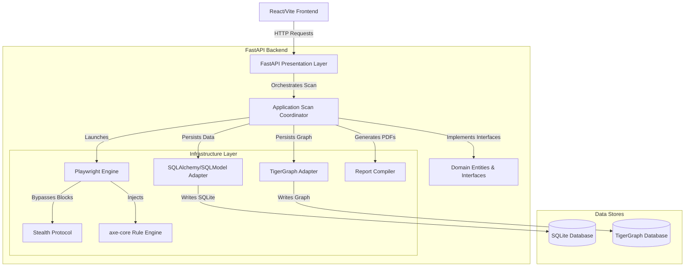
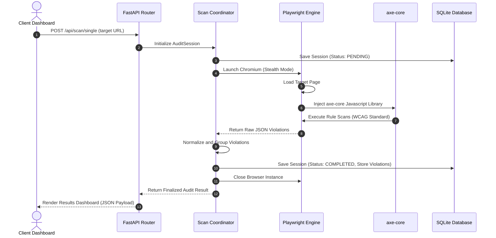

# Web Accessibility Auditor

An automated, high-fidelity web accessibility forensics engine built to diagnose, record, and resolve compliance violations against Web Content Accessibility Guidelines (WCAG 2.1 A/AA/AAA). The system utilizes headless browser execution, automated rule injection, and graph relationship persistence to identify accessibility blockers for users with motor, cognitive, visual, and auditory impairments.

## Core Architectural Concepts

The system is designed around several key engineering patterns to ensure reliability, security, and separation of concerns:

1. **Domain-Driven Design and Clean Architecture**: The backend codebase is strictly segregated into layers:
   * **Domain Layer**: Core business models (AuditSession, Violation, AgentFinding), exceptions, and repository interfaces. Contains no external framework dependencies.
   * **Application Layer**: Use cases, service orchestrators, and validation logic.
   * **Infrastructure Layer**: Adapter implementations for database storage, Playwright automation, network analysis, and PDF compilation.
   * **Presentation Layer**: FastAPI controllers, middleware, and request validation schemas.
2. **Headless Browser Automation (Playwright Engine)**: The engine spawns headless Chromium instances to navigate target web pages, execute JavaScript, load dynamic content, and inject the axe-core testing library to identify layout and structure issues.
3. **Anti-Bot Bypass Protocol (StealthProtocol)**: To ensure scans are not blocked by security firewalls, the headless browser is configured with custom user agents, spoofed viewport parameters, and anti-fingerprinting protocols to bypass standard bot detectors.
4. **Dual-Storage Persistence Layer**:
   * **SQLModel (SQLite)**: Used for local session storage, task queuing, and relational integrity of the audit entities.
   * **TigerGraph**: An optional graph repository configuration mapping the structural tree nodes of accessibility issues to visualize structural DOM relationships.

---

## System Architecture

The following component diagram outlines the request routing and component dependencies across the client, presentation, execution, and persistence layers:



---

## Execution Flow (Audit Request Lifecycle)

The sequence diagram below details the end-to-end execution of a single-page audit request from initiation to database persistence and client response:



---

## Feature Matrix

* **Automated Accessibility Audits**: Scans target URLs against WCAG 2.1 standards, categorizing violations into levels of impact (critical, serious, moderate, minor).
* **DOM Selector Targeting**: Captures the exact CSS selector, HTML node snippet, and failure summary for every violation.
* **Sitemap and Link Crawler**: Automatically extracts internal links and sitemap definitions to execute batch-audits across entire sites.
* **Interactive Graph Visualization**: Provides an interactive visual interface displaying the hierarchical relationship between scanned pages, nodes, and found violations.
* **Detailed Remediation Guidance**: Generates programmatic recommendations, advice, and instructions explaining how developers can fix specific failures.
* **PDF Exporter**: Compiles scan results into structured, professional PDF documents.

---

## Database Schema Specifications

The relational schema is implemented using SQLModel tables:

### 1. AuditSessionModel
Represents a single scan operation executed on a specific date.
* `id` (UUID, Primary Key)
* `url` (String, Indexed)
* `status` (String): e.g., `PENDING`, `COMPLETED`, `FAILED`
* `created_at` (DateTime)
* `completed_at` (DateTime, Nullable)
* `overall_score` (Float)
* `total_violations` (Integer)

### 2. ViolationModel
Represents an accessibility failure discovered during an audit. Each model links back to its parent session.
* `id` (UUID, Primary Key)
* `session_id` (UUID, Foreign Key referencing `AuditSessionModel.id`)
* `rule_id` (String): e.g., `color-contrast`, `image-alt`
* `impact` (String): e.g., `critical`, `serious`, `moderate`, `minor`
* `description` (String)
* `help_url` (String)
* `selector` (String): CSS selector of the failing element
* `html_snippet` (String): The raw failing HTML node
* `remediation_advice` (String)

---

## Deployment Architecture

The application is deployed using a decoupled, production-grade cloud layout:

* **Frontend Hosting (Vercel)**:
  * Live URL: https://web-accessibility-auditor-roan.vercel.app
  * The React client is built using Vite and deployed as a static Single Page Application (SPA).
  * Points to the backend API via the build environment variable `VITE_API_URL`.
* **Backend Hosting (Hugging Face Spaces)**:
  * Live URL: https://srijato-das-web-accessibility-auditor.hf.space
  * Run inside a Docker container utilizing a Python base image.
  * Launches Playwright inside a secure, non-root user account (UID 1000) to ensure container stability.
  * Inbound requests are handled on port `7860`.

---

## Local Installation and Setup

### 1. Prerequisites
Ensure you have the following installed on your machine:
* Python 3.12+
* Node.js 18+
* Poetry (Python Package Manager)

### 2. Backend Setup
Navigate to the project root directory:

```bash
# Install Python packages and create virtual environment
poetry install

# Install Playwright browser dependencies (Chromium)
playwright install chromium
```

To run the FastAPI server locally on port `8000`:
```bash
poetry run python run_server.py
```

### 3. Frontend Setup
Navigate to the frontend directory:

```bash
cd frontend

# Install package dependencies
npm install
```

Configure your local environment variables by creating a `.env` file inside the `frontend` folder:
```env
VITE_API_URL=http://localhost:8000/api
```

To run the Vite development server locally on port `5173`:
```bash
npm run dev
```
