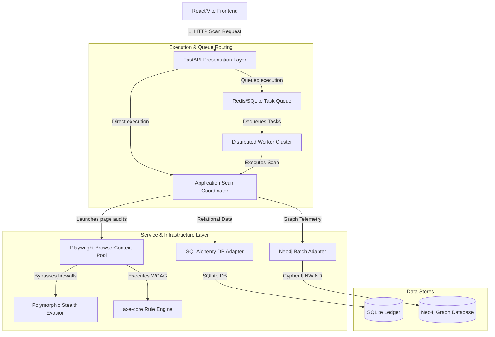
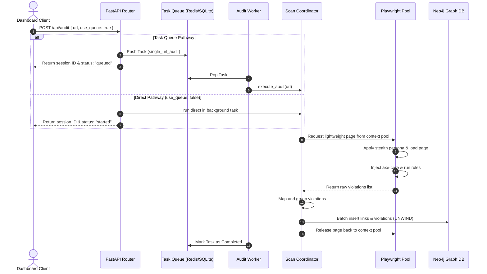

# High-Performance Web Accessibility Auditor

An automated, high-fidelity web accessibility forensics engine built to diagnose, record, and resolve compliance violations against Web Content Accessibility Guidelines (WCAG 2.2 A/AA/AAA), GIGW 3.0, and RBI circulars. The system utilizes recycled headless browser execution, automated rule injection, and graph relationship persistence to identify accessibility blockers at scale.

---

## Key Performance & Systems Optimizations

To handle high-throughput audits on cloud environments (like Hugging Face Spaces and Vercel) without resource degradation, the engine incorporates three high-performance systems-level optimizations:

1. **Playwright BrowserContext Recycling & Evasion**:
   Instead of launching a separate browser context for every scanned page (which incurs heavy CPU overhead and initialization latency), the engine shares a single, stealth-configured `BrowserContext`. Audits spin up light-weight page instances from the shared pool. If a WAF block or runtime error occurs, the context is safely discarded, a user persona rotation is triggered, and a clean context is recycled.

2. **Cypher UNWIND Database Write Batching (Neo4j)**:
   Rather than writing links and component violations to the graph database one-by-one (incurring heavy database RTT costs), the repository buffers transactions in-memory and flushes them to Neo4j in bulk. This uses Cypher `UNWIND` merge query arrays, reducing database connection transactions by up to 90%.

3. **Dual-Persistence Task Queue & Worker Nodes**:
   Features an asynchronous broker (`RedisTaskQueue`) with transparent local SQLite file fallback. Incoming API payloads can bypass concurrent web-server execution by specifying `use_queue: true`. Tasks are queued and ingested sequentially or concurrently by independent `AuditWorker` nodes, preventing web-server process crashes.

---

## System Architecture

The following diagram outlines the component routing and asynchronous task queuing flow across client, API, broker, and backend execution layers:



---

## System Execution Flow

The sequence diagram below details the dual lifecycle pathways (Direct Background Task vs. Async Task Queue Worker):



---

## Detailed Command CLI and Services

The orchestrator console (`batch_audit.py`) manages administrative, background worker, and telemetry operations:

```bash
Accessibility Auditor Console [v0.1.0]
Usage: python batch_audit.py [options]

Options:
  --help, -h          Show this help message
  --add-target [url]  Add a new target domain to the audit registry
  --dispatch          Dispatch all active domains to the task queue
  --discover [url]    Autonomously discover links (sitemap/robots.txt) & dispatch to queue
  --worker            Start an autonomous task worker node
  --dashboard         Launch the terminal-based (TUI) real-time cluster monitor
  --report            Generate an HTML summary report from the database sessions
```

---

## Testing & Coverage Gateway

The codebase includes an in-depth unit and integration testing suite under the `tests/` directory verifying components, API endpoints, mock databases, and error boundaries.

### Test Runner Configurations
* **`pytest.ini`**: Configures verbosity, stdout CLI log capturing, and automatic async markers (`asyncio_mode = auto`).
* **`.coveragerc`**: Targets coverage metrics to the `src/auditor` package, omitting test folders and code stubs.

### Running Tests
To verify dependencies, run all unit/integration tests, and generate HTML code coverage reports:

* **Windows**:
  ```cmd
  run_tests.bat
  ```
* **Linux / macOS**:
  ```bash
  chmod +x run_tests.sh
  ./run_tests.sh
  ```
* **Results**: Open the generated interactive page at `htmlcov/index.html` to inspect coverage ratios per file.

---

## Local Installation and Setup

### 1. Prerequisites
* Python 3.12+
* Node.js 18+
* Poetry
* Redis (Optional: Fallback SQLite queue is utilized if Redis is offline)
* Neo4j (Local Neo4j Desktop or Aura Cloud connection)

### 2. Backend Setup
1. Clone the repository and navigate to the project directory:
   ```bash
   poetry install
   playwright install chromium
   ```
2. Create a `.env` configuration file in the project root:
   ```ini
   NEO4J_URI=bolt://localhost:7687
   NEO4J_USER=neo4j
   NEO4J_PASSWORD=your_secure_password
   REDIS_URL=redis://localhost:6379
   DATABASE_URL=sqlite+aiosqlite:///./reports/data/audit_results.db
   ```
3. Run the FastAPI development server:
   ```bash
   poetry run python run_server.py
   ```

### 3. Frontend Setup
1. Navigate to the `frontend` folder and install dependencies:
   ```bash
   cd frontend
   npm install
   ```
2. Create a `.env` file in the `frontend` folder:
   ```env
   VITE_API_URL=http://localhost:8000/api
   ```
3. Start the Vite React app locally:
   ```bash
   npm run dev
   ```
